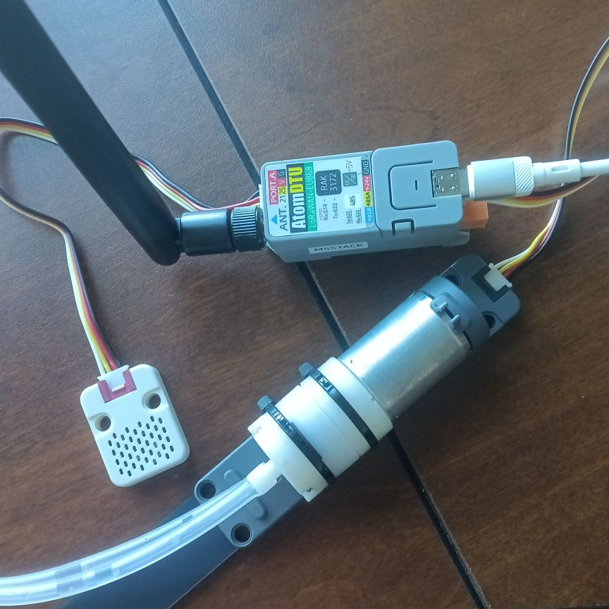

# Sprout — LMAO Smart Irrigation Node

**Node name: `sprout`** — an edge irrigation controller built on the M5Stack
Atom Lite stacked on the DTU LoRaWAN base (A152-EU868), fused with the M5Stack
Watering Unit (soil moisture + pump) and the ENV III sensor board (air
temp/humidity + pressure). It fuses soil moisture + air temperature/humidity +
pressure trend into an irrigation decision, drives a pump, and reports every
sensor sample to the LMAO server over LoRa for offline ML training.



**The development blueprint is the single source of truth:**
[`docs/development-plan.md`](docs/development-plan.md)
(also at `/home/pondycrane/smart-irrigation-dev-plan.md`).
**Verified hardware reality (pin map, DTU firmware, sensor placement, known
collisions):** [`docs/hardware-verification.md`](docs/hardware-verification.md).

## System at a glance (verified topology, 2026-09-16)

```
Atom Lite (MicroPython)                     STM32WLE5CC DTU (LoRaWAN) @UART G19/G22
├── Grove bus (SCL=G32, SDA=G26)            ├── OTAA / LoRa uplink+downlink
│   └── Watering Unit U101                  └── Grove Port A bus (SCL=G21, SDA=G25)
│       ├── moisture probe → ADC G32            └── ENV III
│       └── pump control   → GPIO G26               ├── SHT30 (air T / humidity)
├── control engine (verdict: docs/                  └── QMP6988 (pressure, no mux)
│   algorithm-evaluation.md)
└── LXMF SensorReport ─── UART ─────────────────────────┘
                                             │
                                             ▼
                       LMAO server (K8s / Turing Pi 2):
                       LXMF router → SensorReport → NATS → DuckDB
                       CommandRequest downlink → pump
```

## Repository layout (grown by the workflow, not scaffolded up front)

```
smart_irrigation/
├── README.md                     # this file
├── AGENTS.md                     # hard rules for coding agents
├── docs/
│   ├── development-plan.md       # the blueprint (phases 1–8 + appendices)
│   └── algorithm-evaluation.md   # MANDATORY deliverable before firmware work
├── firmware/                     # Atom Lite MicroPython node (µReticulum port)
│   ├── config.py, lora_boards.py, flash.py, boot.py, main.py
│   ├── lib/urns/                 # vendored copy of cardputer_client/lib/urns
│   ├── lib/sensors/              # pca9548a.py, dht20.py, ...
│   ├── proto/lma_encoder.py      # vendored copy
│   ├── src/                      # control engine, sensor fusion, pump
│   └── tests/                    # host-side pytest with MicroPython mocks
├── stm32-dtu/                    # STM32WLE5CC LoRaWAN bridge (C, PlatformIO)
├── k8s-app/                      # server-side ingest extensions (if not in repo root)
├── scripts/                      # sim/benchmark/dataset tools (dev machine)
└── tests/                        # E2E + integration tests (Bazel targets)
```

## Hardware (fixed — per blueprint §13, Appendix B)

**Verified 2026-09-12, re-verified 2026-09-16 (final functional pass = PASS).**
See [`docs/hardware-verification.md`](docs/hardware-verification.md) for
evidence, pin map, and open items. Summary:

| Component | Verified reality |
|-----------|------------------|
| Atom Lite (ESP32-PICO-D4, not S2) | FTDI `0403:6001` "M5stack"; MicroPython v1.29.0; MAC `c8:85:41:67:dd:34` |
| Stack | Atom Lite on **DTU LoRaWAN base (A152-EU868)** via 9-pin socket; **ENV III on base Port A** |
| Atom ↔ DTU UART | **TX=G22, RX=G19** @115200; DTU `AT` alive (**RUI_4.0.6**, P2P mode `AT+NWM=0`) |
| Grove bus (Atom) | **SCL=G32, SDA=G26** — carries the **Watering Unit only** (analog+GPIO, not I2C) |
| Watering Unit U101 | **moisture → ADC G32** (air ≈2067 / submerged ≈1580, 12-bit); **pump → GPIO G26**, active-HIGH; **3× supervised 5 s fail-off motor tests ✅**; pump left driven LOW |
| Port A bus (base) | **SCL=G21, SDA=G25** — independent I2C rail: **SHT30 @0x44** (27.04 °C / 53.89 % RH) + **QMP6988 @0x70** |
| QMP6988 pressure | ✅ **collision resolved by topology** (no mux on Port A) — chip ID clean `0x5C`; hPa readout pending Phase 2 driver |
| Pump safety | ⚠️ supervised tests done only; **hardware pull-down + default-OFF `boot.py` still mandatory** (issue #119) |

## The algorithm evaluation gate

The blueprint's Challenge Brief (Appendix 13) **forbids writing firmware
before an algorithm evaluation exists**. `docs/algorithm-evaluation.md` must
contain: the verdict across state-machine / PID / fuzzy / model-based-hybrid,
the rulebase or ET₀ model, the ML dataset schema, the on-node protocol
recommendation, risk assessment, and a revised phase plan — with benchmark
evidence. Run it first:

```bash
cd /home/pondycrane/LMAO
archon workflow run smart-irrigation-dev "Phase 0: algorithm evaluation"
```

Then develop phases/features one at a time:

```bash
archon workflow run smart-irrigation-dev "Phase 2: PCA9548A driver + sensor drivers"
archon workflow run smart-irrigation-dev "Phase 3: control engine per evaluation verdict"
archon workflow run smart-irrigation-dev "Phase 6: UART bridge + LoRaWAN integration"
```

See [`../docs/archon-workflows.md`](../docs/archon-workflows.md) for the full
workflow reference.

## Safety (also in AGENTS.md)

- Never use esptool to probe/flash the Cardputer, RNode, or Atom Lite. Atom
  Lite file uploads go only through `mpremote`/the raw-REPL flash tool; esptool
  is allowed only for the documented one-time MicroPython install/backup at
  115200 baud.
- Never poke serial ports ad hoc while a gate/test is running. The sanctioned
  probe is `firmware/tools/probe_hardware.py` (read-only, restores the mux).
- Leave the production Cardputer running with its production config.
- **Never power the pump during probing/validation.** The Watering Unit's
  motor runs whenever its control line floats — it must stay disconnected until
  the default-OFF boot order + hardware pull-down are implemented and verified.
- The pump must always be driven through the safety overrides (saturation
  lockout, pressure override only when pressure is readable, battery cutoff,
  min on/off, daily cap), with fail-off on any error.
